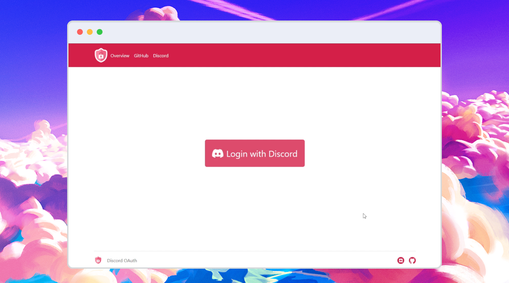

<h1 align="center">
  
  <br>
  Discord OAuth
</h1>

<h4 align="center">An Open Source demonstration of a PHP <a href="https://discord.com/developers/docs/topics/oauth2" target="_blank">Discord OAuth</a> login flow, with multiple examples to build on top of.</h4>

<br>

<p align="center">
  <!--License-->
  <a href="https://github.com/MarkisDev/discordoauth/blob/master/LICENSE"></a>
  <!--Contributions-->
  <a href="https://github.com/MarkisDev/discordoauth/graphs/contributors" alt="Contributors"></a>
  <!--Stars-->
  <a href="https://github.com/MarkisDev/discordoauth/stargazers"></a>
  <!--Discord-->
  <a href="https://join.markis.dev"></a>
  <!--Donate-->
  <a href="#support">
    
  </a>
</p>

<p align="center">
  <a href="#key-features">Key Features</a> •
  <a href="#how-to-use">How To Use</a> •
  <a href="#contributing">Contributing</a> •
  <a href="#support">Support</a> •
  <a href="#license">License</a>
</p>
<div align="center">
  
</div>

<br>

## Key Features

* PHP sessions
* Get user data
  - ID, Username, Avatar, Discrim etc.
* Get user connections
  - Battlenet, Facebook, Github, Spotify, Twitter, Youtube etc.
* Get user guilds
  - IDs, Icons, User permissions, Enabled guild features etc.
* Get guild user
  - Nickname, Roles, Join date etc.
* Join user to guild
* Get guild object (requires bot)
* Give guild role (requires bot)
* ...and more!

<br>

## About

This is a small collection of demos, which you can use to start building your Discord PHP application from.

This is in no way a framework, but more a sort of *template* that you can use to build on top of.

The idea behind the repo is to give developers a nice starting point to further expand their application from. If you do end up expanding the possibilites of the script, be sure to check out [Contributing](#contributing) in this repo!

What is this **not**?
* This is not a library
* This is not a one-click installer
* This is not a final product

<br>

## How To Use

**Prerequisites:**
* [PHP >= 7](https://php.net/)
* **A web server** for running the PHP application
* [Discord Application](https://discord.com/developers/applications) with OAuth2 ``CLIENT ID`` and ``CLIENT SECRET``

<br>

Start by cloning this repository to your computer.
```bash
$ git clone https://github.com/MarkisDev/discordoauth
```

Now let's include the discord.php file in our authentication file, loading all the classes and run it with the configuration:
```php
use Discord\Auth;
use Discord\PromiseManager;
use Discord\Get;
use Discord\Set;

require 'discord.php';

$auth = new Auth([
  "client_id" => "1234567890",
  "client_secret" => "a1b2c3d4e5f6g7",
  "scopes" => "identify+guild",
  "redirect_url" => "this_page"
]);
```

Start the authentication:
```php
$auth->go()
```
Here you are supposed to use the `then` or `done` with a callback function

```php
$auth->go()->then(function (Get $get, Set $set) {
  $user = $get->user();
  $guilds = $get->guilds();
});
```
If you included a state in the url you can already check it from the go function:
```php
$auth->go($state)->then(....);
```

Fill out the config file as shown in the examples with values from [Discord Developers Dashboard](https://discord.com/developers/applications).

When you have done this, you must copy the full `redirect_url` link defined in the config, and paste it on the [Discord Developers Dashboard](https://discord.com/developers/applications) under your Applications OAuth2 Redirects.


> **Note**
> You can add multiple redirects to the same application, so feel free to also add the redirects for the other demos:<br>
> `http://localhost/admin-dashboard/includes/login.php`<br>
> `http://localhost/bot-dashboard/includes/login.php`

When you have done all the above steps, you should be able to visit [localhost/simple-demo](http://localhost/simple-demo) in your browser, and see the OAuth demo in action!

## Documentation
A quick documentation showing the functions of each class.

### `Auth`
```php
use Discord\Auth;
```
Functions:
```php
__construct(array $config) : void

<STATIC> state() : string

go(string $state = NULL) : PromiseManager
```

### `PromiseManager`
```php
use Discord\PromiseManager;
```
Functions:
```php
__construct(string $token, mixed $config) : void

then(mixed $callback) : callback

done(mixed $callback) : then
```

### `Get`
```php
use Discord\get;
```
Functions:
```php
__construct(string $token, mixed $config) : void

user() : user object

guilds() : guilds object

guild(int $id) : guild object

connections() : connections object
```
> **Note**
> This class is already started in the PromiseManager class callback

### `Set`
```php
use Discord\Set;
```
Functions:
```php
__construct(string $token, mixed $config) : void

role(int $guild, int $user, int $role) : result
```
> **Note**
> This class is already started in the PromiseManager class callback


If you encounter any issues along the way, give us a visit in our [Discord Server](https://join.markis.dev), and we'll be sure to lead you back on the right track!
<br>

## Contributing

Contributions to the project are **always** welcome!

If you found a bug, please [open an issue](https://github.com/MarkisDev/discordoauth/issues/new/choose) and let us know.

If you have a request for a feature you can also [open an issue](https://github.com/MarkisDev/discordoauth/issues/new/choose) and we will take a look at it.

We accept [pull requests](https://github.com/MarkisDev/discordoauth/compare) for any fixes and/or new features.

If you want to contribute a new demo, please remember to copy any new Discord related functions to the `discord.php` file in the root of the repo.

<br>

## Support
**Support the Author here:**

<a href="https://www.buymeacoffee.com/markisdev" target="_blank"></a>

<br>

**Support the Maintainer here:**

<a href="https://www.buymeacoffee.com/foxdev" target="_blank"></a>

<br>

## License

[MIT License](https://mit-license.org/)

```
Copyright (c) 2022 MarkisDev

Permission is hereby granted, free of charge, to any person obtaining a copy
of this software and associated documentation files (the "Software"), to deal
in the Software without restriction, including without limitation the rights
to use, copy, modify, merge, publish, distribute, sublicense, and/or sell
copies of the Software, and to permit persons to whom the Software is
furnished to do so, subject to the following conditions:

The above copyright notice and this permission notice shall be included in all
copies or substantial portions of the Software.

THE SOFTWARE IS PROVIDED "AS IS", WITHOUT WARRANTY OF ANY KIND, EXPRESS OR
IMPLIED, INCLUDING BUT NOT LIMITED TO THE WARRANTIES OF MERCHANTABILITY,
FITNESS FOR A PARTICULAR PURPOSE AND NONINFRINGEMENT. IN NO EVENT SHALL THE
AUTHORS OR COPYRIGHT HOLDERS BE LIABLE FOR ANY CLAIM, DAMAGES OR OTHER
LIABILITY, WHETHER IN AN ACTION OF CONTRACT, TORT OR OTHERWISE, ARISING FROM,
OUT OF OR IN CONNECTION WITH THE SOFTWARE OR THE USE OR OTHER DEALINGS IN THE
SOFTWARE.
```
---


[@f-o](https://github.com/f-o) &nbsp;&middot;&nbsp; [@markisdev](https://github.com/markisdev) 
